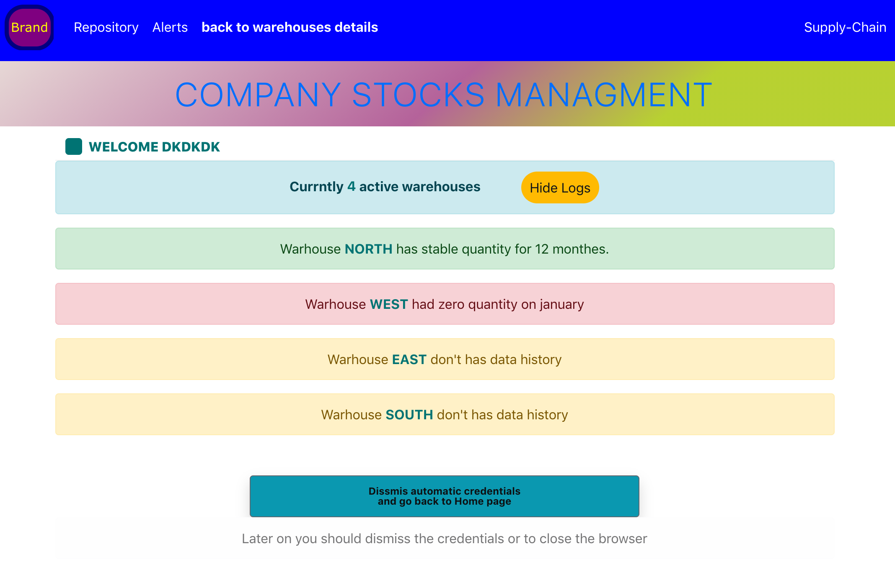

# Supply-Chain

React project for dealing and displaying current and historical company inventory.

## Idea

Sharing warehouses data via props and manage the state of each warehouse with hooks and class based components.<br />
HTTP requests with the Fetch API to JSON files in the public folder are used as data comming from backend.

##### Development on MAC.

<br />

<p float="left">
  
  <br />
  
  <br />
  
  <br />
  
  <br />
  
  <br />
  
  <br />
  
</p>

## Installation & Usage

Clone and run:

```bash
npm install

npm start
```


## License
[MIT](https://choosealicense.com/licenses/mit/)
