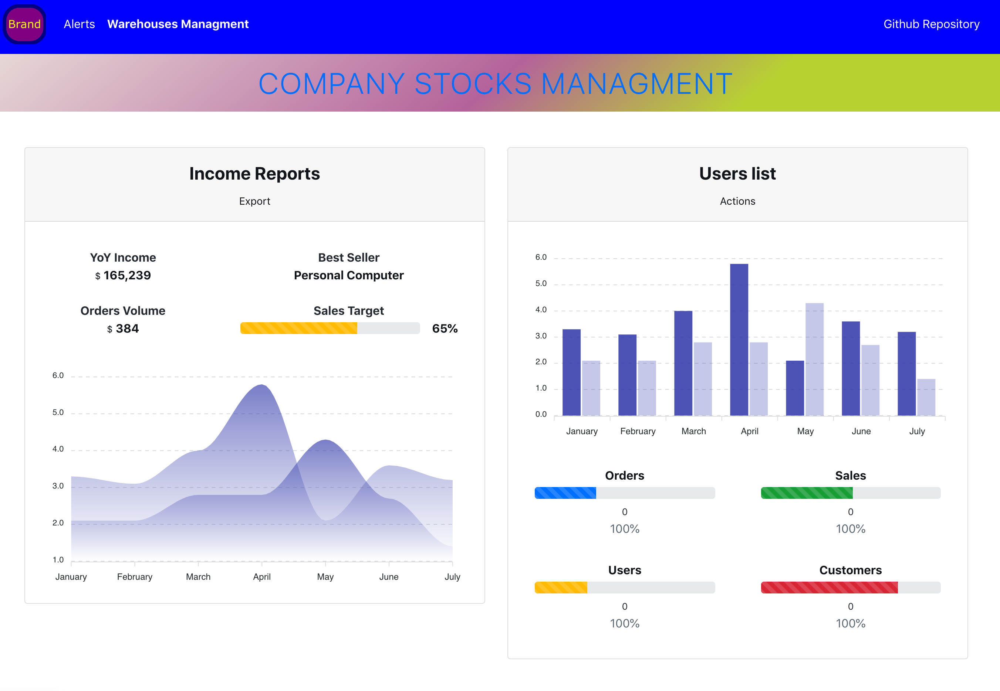

# Supply-Chain

REACT project for dealing and dispaly in the UI companies warehuoses and inventory.

## Idea

Sharing warehouses data via props and manage the state of each warehouse with hooks and class based components.<br />
JSON files in the public folder are used as data comming from backend using the fetch API.
<br /> 
The final purpose is to set alerts for exceptual incidents about the data coming from the external sources.
<br />

Responsive design and state-managment(Redux/MobX) are not in the projcet scope at all. 

##### The app development is on a MAC, on a PC UI may appear differently.

<br />

<p float="left">
  
  <br />
  
  <br />
  
  <br />
  
  <br />
  
  <br />
  
  <br />
  
</p>

## Installation & Usage

Clone and run:

```bash
npm install

npm start
```


## License
[MIT](https://choosealicense.com/licenses/mit/)